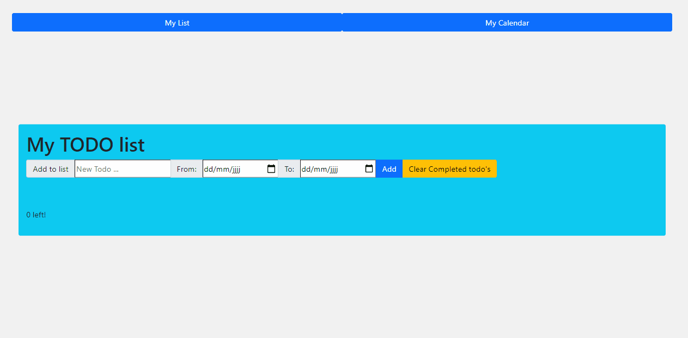

# Intro React

## Todo-list + calendar application:

> - Part of the course: `Mountain`
> - Project: `Introduction React`
> - Tools and languages: `Javascript, React.js, Bootstraps`
---
## [Todo-app](https://intro-react-basile.netlify.app/ "A todo app to add to your todo's")
A simple app where you can add todo's to a list, select a start and end date for that todo,  
mark them as completed (checked) and remove completed todo's.  
  
Additionally the added todo's will be automatically be updated into your calendar.  
  
  
  
### Demo:  
  
  
  
Upon removing the completed todo's, it will also remove the calendar items.
  

## Exercise log:
  
### My constatations:
This was the first time working with react (Todo page), I personally like the efficiency of React.js and the use of components.  
I came back to this exercise to add some functionality to it (Calendar page). It was the second time working on React,  
but I had tried some other packages like Svelte and Vue in the meantime  
  
### Difficulties:
It wasn't easy to find documentation that was not about using classes in React. I had to do a lot of testing and based myself on the few docs I  
found when making the exercise.  
  
The Todo list was somewhat easier to make as it is a popular first exercise to make in React.  
The calendar was mostly done by testing out. I used a package (`react-big-calendar`), And from there I started testing around on how to use it.